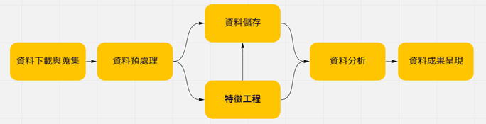
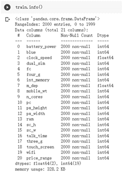
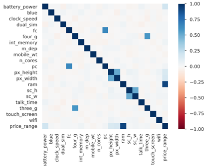

# 數值方法期末專題

### 這價格是怎麼訂的?—應用機器學習分析手機定價

##### 執行學生： 陳彥安
##### 指導教授： 游濟華

## 摘要
本研究將利用來自數據分析平台Kaggle名為 Mobile Price Classification的dataset，分析2000種不同的行動電話，了解不同性能條件與產品價格之間的關係，並透過機器學習來預測、驗證實作成果。結果發現手機定價，有一定程度的預測度，模型訓練集準確率最高達100%，驗證精確度最高可達95%。

關鍵字：機器學習、分類、監督式學習、手機價格、生活應用

## 研究動機與研究問題

### 研究動機
學生最近在換新手機的過程中發覺一支手機的價格可以被許多因素所影響，站在消費者的角度來說，包括價格、功能多樣性、使用需求，甚至品牌商譽、顏色外觀等等；反過來思考，今天站在賣方的立場，包含電池的續航力、販售服務、硬體規格等等都能是我們能賺取利潤的地方，而透過統計數據、機器學習演算法的推導與計算，我們能更有效的去找到這些需要注意的地方。

### 研究問題
本研究將聚焦於不同演算法面對此問題與根據這個dataset有什麼樣的表現。Mobile Price Classification總共只有2000個training data，但有21個特徵，全部都是數值資料，看似簡單易懂，但在面對這種小型資料集時，要如何做特徵的選取或處理，演算法的選擇與參數要如何選擇，更重要的是如何利用我們的知識和看法去解決問題。實作部分，除了常見的'SVC', 'Decision Tree'以外，也應用Ensemble learning中Boosting的做法，包含'AdaBoost', 'Gradient Boosting', 'XGBoost', 'CatBoost',' Regularized Greedy Forest'等演算法，希望能比較Boosting與其它做法與不同Boosting之間的差異。究竟何者最適合這類型的資料集，是我們期待做完以後能得到解答的。

### 文獻探討
對於相對資料單純、容易實作分類演算法的「價格、定價預測(Price Prediction)」類型，有些研究會透過不一樣的特徵選取來進行訓練，甚至有的會自行研發，例如Dongliang Huang, Hamidreza Zareipour等人(2012)在電價預測中嘗試利用自行研發的特徵選取工具去實作，發現到即便擁有強大的資料篩選機制仍有不少突發狀況或是不可抗力之因素而有完美無缺的成績表現。

手機定價的預測許多人著重在不同演算法的展演，例如Nasser(2019)的ANN、Pramanik(2021)、Kalaivani(2021)多種分類法等，也有人如Mustafa ÇETİN(2021)強調參數的調整是能在此資料集中得到高精確度的關鍵。但共同問題皆是模型成果取決上的過擬合與欠擬合是否能得到改善，我們這次研究也會有些許的討論。

## 研究方法及步驟
這次使用的資料集Mobile Price Classification總共只有2000個training data、21個特徵。本研究利用常見的資料前處理方式進行分析，再利用7種機器學習方法，計算分類的準確率，比較各方法的效果並利用各方法的混淆矩陣，試分析影響手機定價的具體因素。

### 資料蒐集與前處理
資料集包括總共21個特徵。資料集中的樣本總數為2000個。而由於本實驗中使用的資料集是沒有離群值和缺失值的，所以不需要計算缺失值，也不需要去除異常值(圖1)。此外，透過Pandas Profiling report能看出個特徵的離散屬性、相關度等資料，如對於各特徵屬性，能觀察Correlation heat map如圖2所示

### Boosting Algorithm
Ensemble Learning(集成學習)主要用來減小監督式學習中的偏差(Bios)與變異(Variance)，將弱學習器轉換為強學習器的機器學習算法。Boosting裡的分類器則會由前一個分類器的結果準確度高的子集給予較高權重而做更進一步的修正，因此每個分類器皆有所關連。在每一輪改變訓練數據的權值或分布，提高在前一輪被弱分類器判錯的樣本的權值，減小前一輪分對樣本的權值，使得分類器對判定數據有較好的效果。

### 成果討論
在實驗中可以清楚的看到SVM對高維資料進行了比較好的處理，且發現linear kernel在SVM中給出了更合適的結果。由此可見，有些資料集的特徵之間存在著線性關係，這點可以從profile report上察覺，在此也驗證了這個結果。除了對高維資料的高延展性，相對於其他梯度提升演算法，SVM模型的做法安全且穩定，過擬合的風險相對較小，超平面的分類也不會隨著資料集的變化而劇烈改變。

其他部分，XgBoost和GradientBoosting等相關方法取得了訓練準確率的高分，但在驗證集上的表現有所不同，由此可見這些模型容易受到偏差值和雜訊資料的影響，造成overfitting的狀況，也許是因為訓練數量有限而造成的成果。

## 結論與展望
「從錯誤中學習」是Boosting的精神，透過一次又一次的學習與修正能得到最優異的成果，但也要注意，若一開始在訓練集有錯誤的標記的情況下，這些提升算法雖會提升樣本正確率，結果卻是錯誤的，即便是正確標記，也要有合適的算法才會有好的成果。從此可見，不論是做機器學習或其他實驗，要學會明辨是非，做客觀、謹慎的行動搭配正確、正向的方法才是走向正途的不二法門。

這次研究可以看到機器學習在生活上能有多元的應用，對我們來說可能只是期末報告，但這樣的預測與驗證，透過資料的EDA、Data Mining、ML、Deep Learning等手法，能為更大型的數據與資料做更有用、更有效的決策。

很高興也很感謝這學期的數值方法課程，包含老師的指導與助教的協助，雖然大多數是線上教學，但內容相當豐富，每周的lab跟作業也提升了實作的能力，期待未來的路上也能發揮所學。

